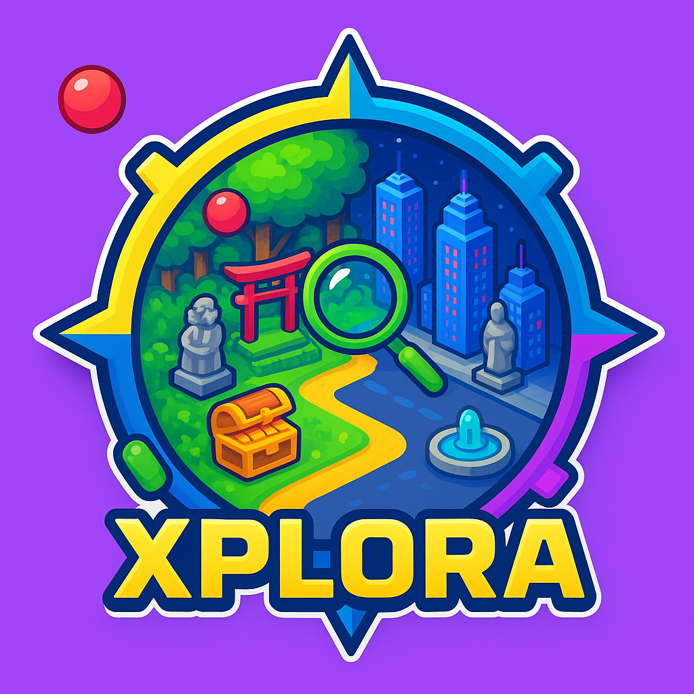

<!-- prettier-ignore -->
<p align="center">
  
  <h1 align="center">Xplora</h1>
  <p align="center">A playful, social geolocation quest app built with Expo, React Native and Solana integration.</p>
  <p align="center">
    
    
    
    
    
    
  </p>
</p>

## Why Xplora?

Xplora turns everyday places into playful, social quests. It combines location-triggered challenges, event discovery, leaderboards and web3 features (Solana) to create community-driven real-world experiences.

Built for mobile with Expo and React Native, Xplora is a living playground for gamified exploration.

## Highlights

- Location-aware quests & geofencing
- Real-time leaderboards and achievements
- Event discovery and time-based challenges
- Push notifications and haptics
- Solana integration for optional on-chain features
- Built with Expo Router, TypeScript and React Query

<!-- ## Screenshots -->

## Quick start

Prerequisites: Node (or Bun), Expo CLI recommended. On macOS with zsh, these commands work well.

Install dependencies (choose your package manager):

```bash
# with bun
bun install

# or with npm
npm install

# or with yarn
yarn install
```

Start Expo dev server and open on a device or simulator:

```bash
# run the Metro bundler + Expo dev tools
npm run start

# to run on Android device (with dev client / emulator)
npm run android

# to run on iOS device / simulator
npm run ios
```

If you use `bun` in the repo, you can also run the `bun` equivalents above.

## Project structure (select)

- `app/` — screens, layouts, router
- `components/` — UI building blocks
- `assets/images/` — logos, hero and profile images used in README
- `hooks/` — custom hooks like geofencing & location
- `utils/` — adapters and helpers (including Solana)
- `query/` & `lib/` — React Query hooks and config

## Tech stack

- Expo + React Native
- TypeScript
- React Query for data fetching
- Solana web3.js integration
- Geofencing and location tracking

## Badges & trackers (examples)

You can add GitHub and CI badges here (the repo already includes a few examples above). Replace the shields or point them at your CI and releases for live status.

## Contributing

We welcome contributions. Quick guidelines:

1. Fork the repo and create a feature branch.
2. Keep changes small and focused. Add tests where appropriate.
3. Open a pull request describing the change.

If you'd like to help with design or documentation (README/screenshots), add an issue and tag it `good first issue`.

## Security & Environment

- The app uses runtime secrets (API keys, 3rd-party credentials). Don't commit secrets — use environment variables and `dotenv` for local development.
- For iOS/Android keys (push notifications, Maps, etc.) see `credentials.json` and platform-specific folders.

## Maintainers & Contact

Maintained by the Xplora team — see the GitHub repo for contributors and activity.

If you'd like a demo or help running the project locally, open an issue or reach out via the repository.

## License

This repository is currently marked as private in `package.json`.

---

Made with ❤️ using Expo, React Native and a sprinkle of curiosity.